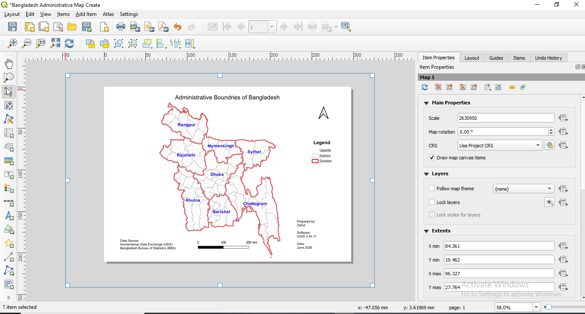

# Bangladesh-Administrative-Boundary-Map
Professional GIS project visualizing Bangladesh administrative boundaries using QGIS.

# 🇧🇩 Bangladesh Administrative Boundary Map

A professional GIS mapping project created using **QGIS 3.44.11**.

## 📌 Project Overview

This project visualizes the administrative boundaries of Bangladesh at three levels:

- Division
- District
- Upazila

## 🛠 Software

- QGIS 3.44.11

## 🗂 Data Source

- Humanitarian Data Exchange (HDX)
- Bangladesh Bureau of Statistics (BBS)

## 📁 Project Structure

```
output/
project/
screenshots/
docs/
```

## 🖼 Project Preview



## 📍 Map Information

Projection: EPSG:4326 (WGS 84)

Administrative Levels:

- Division (8)
- District (64)
- Upazila (495)

Software:
QGIS 3.44.11

## 📄 Outputs

- PDF Map
- PNG Map
- QGIS Project (.qgz)

## 🎯 Skills Demonstrated

- GIS Mapping
- QGIS
- Cartography
- Vector Data Management
- Symbology
- Labeling
- Print Layout Design
- Spatial Data Visualization
- Map Layout Design
- Administrative Boundary Mapping
- Open Data Processing
- Geospatial Data Management


## 👤 Author

**Zahid**

Aspiring GIS Analyst from Bangladesh.
